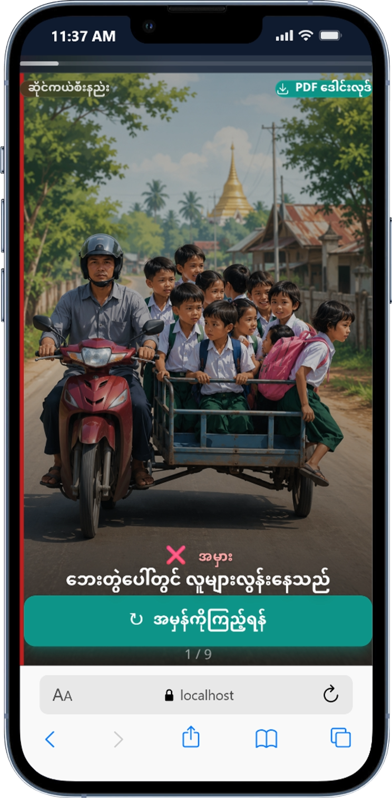
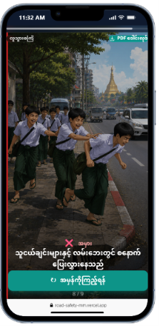
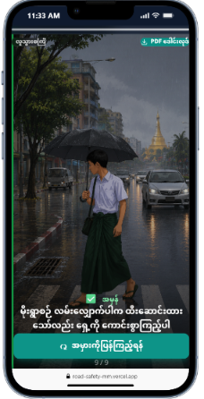
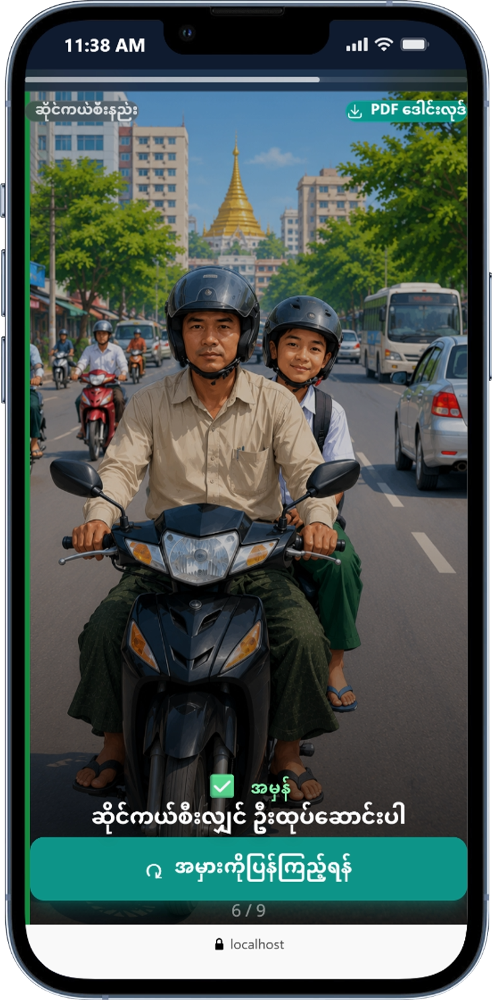

# 🚦 လမ်းအန္တရာယ်ကင်းရှင်းရေး — Road Safety for Myanmar Children

<p align="center">
  
  
  
  
</p>

## The Problem

Myanmar has one of the highest road fatality rates in Southeast Asia, with children being particularly vulnerable. Most schools lack projectors or screens to teach road safety interactively, and existing materials are outdated, text-heavy, and not engaging for young learners.

## The Solution

A mobile-first learning app that teaches road safety to Myanmar children (ages 6–17) through **visual flip cards** — no reading required. Children see the wrong behavior (red ❌), tap to reveal the correct behavior (green ✅), and learn through color, icons, and simple Burmese captions.

## Features

- **Visual Flip Cards** — Tap to flip between wrong (❌) and right (✅) behavior
- **Horizontal Story Feed** — Instagram-style swipeable feed, no complex navigation
- **5 Safety Topics** — Walking, Helmet, Sidecar, Bicycle, Tricycle
- **14+ Scenarios** — Real-world situations children encounter daily
- **Downloadable Flashcards** — Teachers can download PDF on their phone and print for classroom use (no projector needed)
- **Fully in Burmese** — All text in Myanmar Unicode for accessibility
- **Mobile-First Design** — Optimized for 320px–428px screens
- **Quiz Mode** — Optional "Which one is safe?" active recall practice


## How It Works

1. Children pick a **topic** (Walking, Helmet, Sidecar, Bicycle, or Tricycle)
2. They see the **wrong behavior** (red ❌) on a visual card
3. **Tap to flip** — the card reveals the **correct behavior** (green ✅)
4. Each card has a simple **Burmese caption** — no reading skill required
5. **Progress dots** show how many cards they've explored

## Live Demo

🔗 [road-safety.vercel.app](https://road-safety.vercel.app/)

## Why This Matters

- **Accessibility** — Works on any phone, no app store required
- **Teacher-Friendly** — PDF download lets teachers print and teach without technology
- **Engaging** — Visual-first approach matches how children actually learn
- **Culturally Relevant** — Built specifically for Myanmar roads and Myanmar children

## Contributing

Contributions are welcome! Feel free to open issues or submit pull requests.

```bash
# Fork the repo
# Create your feature branch
git checkout -b feature/amazing-feature

# Commit your changes
git commit -m "Add amazing feature"

# Push to the branch
git push origin feature/amazing-feature
```

## Acknowledgments

- Built with ❤️ for the children of Myanmar
- Illustrations designed for Myanmar road scenarios

## License

This project is for **educational purposes only**.

- **Teachers** — You are free to use this app in your classroom. No permission needed.
- **Students** — Learn from it, share it, and stay safe on the roads.
- **Not for sale** — You may not sell this software, its content, or any derivative work.

For other uses, please contact the author.
