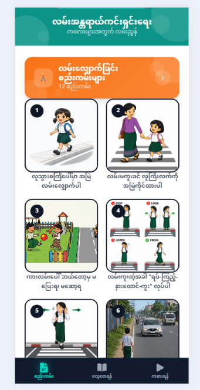
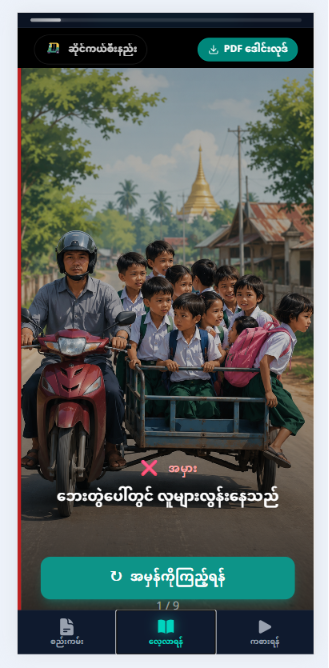
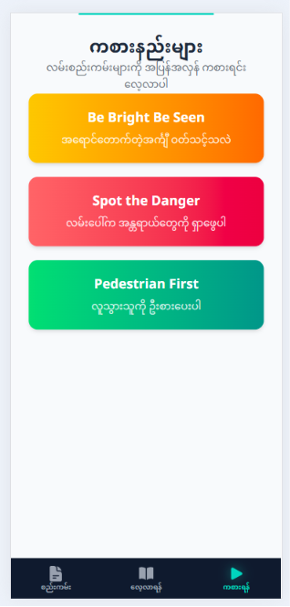
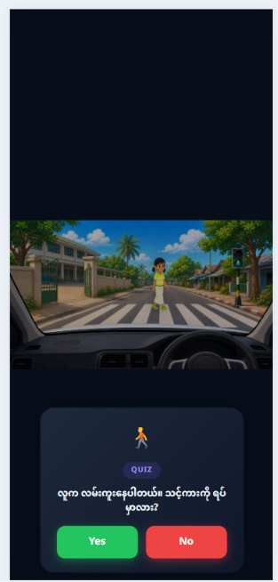

# 🚦 လမ်းအန္တရာယ်ကင်းရှင်းရေး — Road Safety for Myanmar Children

  
  
  
  

## The Problem

Myanmar has one of the highest road fatality rates in Southeast Asia, with children being particularly vulnerable. Most schools lack projectors or screens to teach road safety interactively, and existing materials are outdated, text-heavy, and not engaging for young learners.

## The Solution

A mobile-first learning app that teaches road safety to Myanmar children (ages 6–17) through **visual flip cards** and **interactive games** — no reading required. Children learn through color, icons, sound effects, and simple Burmese captions.

## Features

### 📚 Learning Modules
- **Visual Flip Cards** — Tap to flip between wrong (❌) and right (✅) behavior
- **Horizontal Story Feed** — Instagram-style swipeable feed, no complex navigation
- **5 Safety Topics** — Walking, Helmet, Sidecar, Bicycle, Tricycle
- **14+ Scenarios** — Real-world situations children encounter daily
- **Fully in Burmese** — All text in Myanmar Unicode for accessibility
- **Mobile-First Design** — Optimized for 320px–428px screens

### 🎮 Interactive Games
- **Be Bright Be Seen** ✨ — Learn about visibility with animated day/night scenes
- **Spot the Danger** 🔍 — Test hazard awareness with real road scenarios
- **Pedestrian First** 🚶 — Practice yielding to pedestrians with driving simulations

### 🎯 Game Features
- **Animated Characters** — Walking animations with smooth easing
- **Sound Effects** — Correct ✅, wrong ❌, and police siren 🔔 feedback
- **Yes/No Quiz Questions** — Active recall practice after each scenario
- **Visual Feedback** — Immediate color-coded responses (green/red)
- **Score Tracking** — See your progress at the end of each game
- **Retry Option** — Play again to improve your score

### 📱 Additional Features
- **Downloadable Flashcards** — Teachers can download PDF on their phone and print for classroom use (no projector needed)

## How It Works

### Learning Mode
1. Children pick a **topic** (Walking, Helmet, Sidecar, Bicycle, or Tricycle)
2. They see the **wrong behavior** (red ❌) on a visual card
3. **Tap to flip** — the card reveals the **correct behavior** (green ✅)
4. Each card has a simple **Burmese caption** — no reading skill required
5. **Progress dots** show how many cards they've explored

### Game Mode
1. Choose a game from the **Simulator** page
2. Watch the **animated scenario** unfold
3. Answer **Yes/No** to the quiz question
4. Get **instant feedback** with sound effects and visuals
5. See your **score** at the end and try again

## Live Demo

🔗 [road-safety-mm.vercel.app](https://road-safety-mm.vercel.app/)

## Why This Matters

- **Accessibility** — Works on any phone, no app store required
- **Teacher-Friendly** — PDF download lets teachers print and teach without technology
- **Engaging** — Visual-first approach matches how children actually learn
- **Interactive Games** — Fun way to reinforce safety concepts
- **Culturally Relevant** — Built specifically for Myanmar roads and Myanmar children

## Tech Stack

- **React** — Component-based UI
- **Framer Motion** — Smooth animations and transitions
- **Canvas API** — Game graphics and character rendering
- **Web Audio API** — Sound effects for feedback
- **Tailwind CSS** — Utility-first styling

## Acknowledgments

- Built with ❤️ for the children of Myanmar
- Illustrations designed for Myanmar road scenarios
- Sound effects for immersive game experience

## License

This project is licensed under the [MIT License](LICENSE).
